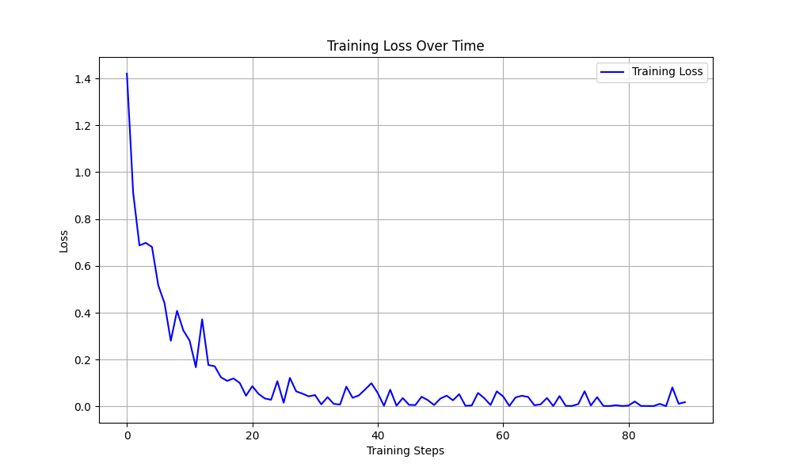

# ATIS Chatbot Evaluation Report

## Overview

This report summarizes the evaluation metrics and training plots for the ATIS Chatbot, a Flask-based web application that assists users in querying flight information using the ATIS dataset. The chatbot leverages NLP models, including a fine-tuned DistilBERT for intent classification and `google/flan-t5-base` with LoRA adapters for response generation, optimized for CPU usage.

## Evaluation Metrics

### Base Classifier Evaluation Metrics (Logistic Regression)
The base classifier, implemented as a Logistic Regression model in `base_classifier.py`, serves as a baseline for intent classification. The evaluation metrics are stored in the `metrics/` directory.

| Metric             | Value   |
|--------------------|---------|
| Accuracy           | 96.49%  |
| Precision (weighted) | 96.14%  |
| Recall (weighted)  | 96.49%  |
| F1-score (weighted)| 96.16%  |

- **File Location**: `metrics/base_classifier_eval_metrics.json`

### Tuned DistilBERT Intent Classifier Evaluation Metrics
The tuned DistilBERT model, used for intent classification, was fine-tuned on the ATIS dataset. The evaluation metrics are as follows:

| Metric             | Value     |
|--------------------|-----------|
| Accuracy           | 99.25%    |
| Precision (weighted) | 99.55%  |
| Recall (weighted)  | 99.25%    |
| F1-score (weighted)| 99.35%    |

- **File Location**: `metrics/tuned_distilBert_Intent_classifier_eval_metrics.json`

### Comparison of Base Classifier and Fine-Tuned DistilBERT Classifier
The base classifier (Logistic Regression) and the fine-tuned DistilBERT classifier were evaluated to compare their performance for intent classification in the ATIS Chatbot. Below is the comparison of their core metrics:

| Metric             | Logistic Regression | DistilBERT (Fine-Tuned) | Difference |
|--------------------|---------------------|-------------------------|------------|
| Accuracy           | 96.49%              | 99.25%                  | +2.76%     |
| Precision (weighted) | 96.14%            | 99.55%                  | +3.41%     |
| Recall (weighted)  | 96.49%              | 99.25%                  | +2.76%     |
| F1-score (weighted)| 96.16%              | 99.35%                  | +3.19%     |

## Training Plots

### Loss Plots
Loss plots provide insight into the training process of the models. These plots are stored in the `plots/` directory.

- **Description**: Loss curves for the DistilBERT intent classifier training.
- **File Location**: `plots/`
- **Training Plot**:
   
- **Training Plot**:
   

### LoRA Training Plots for Flan-T5-Base and Flan-T5-XL
LoRA (Low-Rank Adaptation) was used to fine-tune Flan-T5 models for response generation. Training plots for both Flan-T5-Base and Flan-T5-XL are available.

- **Flan-T5-Base**:
  - **File Location**: `plots/`
   

- **Flan-T5-XL**:
  - **File Location**: `plots/`
  

## Summary
The ATIS Chatbot demonstrates robust performance in intent classification and response generation:
- The tuned DistilBERT intent classifier achieves high accuracy (99.25%) and significantly outperforms the Logistic Regression baseline (96.49% accuracy).
- LoRA fine-tuning was applied to Flan-T5 models, with training plots available for further analysis.
- Visualizations in the `plots/` directory, along with additional files in `metrics/` and `logs/`, provide detailed insights into the training ,evaluation process and chatbot inference.

This report highlights the chatbot’s capabilities and training outcomes, making it a strong candidate for presentation on a non-GPU laptop.

---
